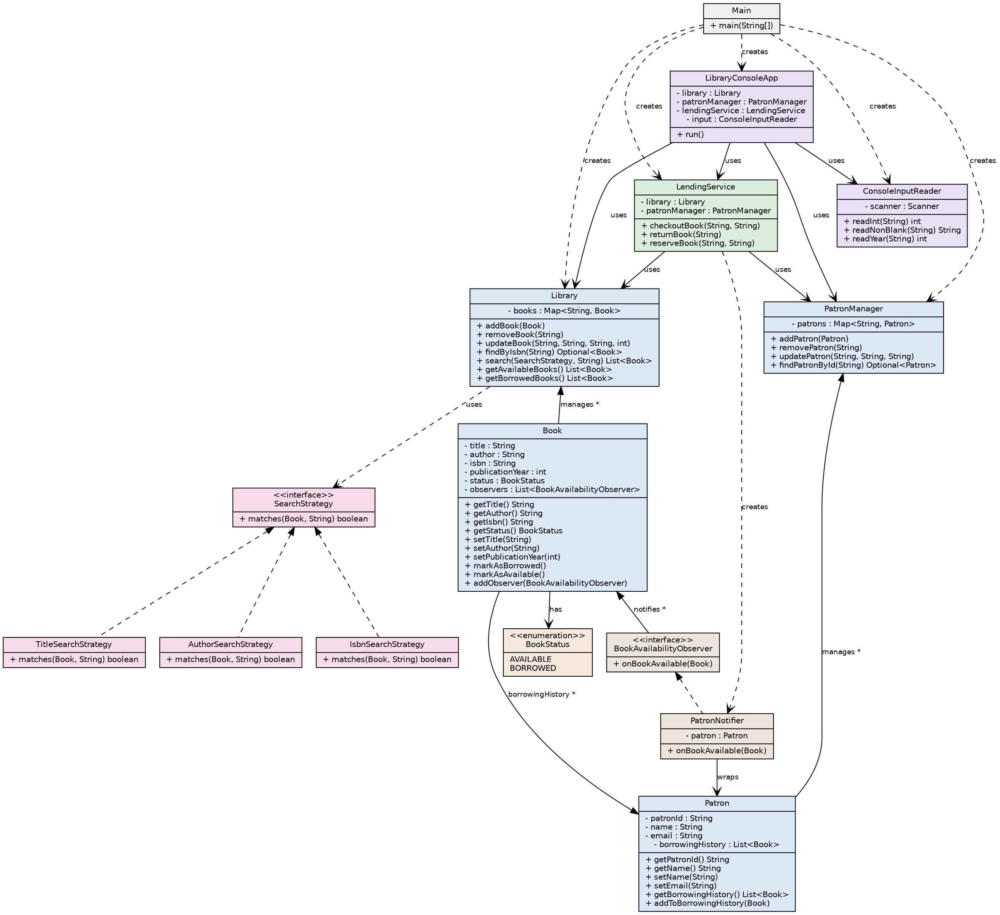

# Library Management System

This is a simple Java program to manage a library.
It lets you add books, add patrons (members), search books,
check out books, return books, and reserve books.

It is built to show good Java skills: OOP, SOLID rules, and design patterns.

## Project Structure

```
com/library/
├── Main.java                      Starts the app
├── main/
│   ├── LibraryConsoleApp.java     Shows the menu, calls the right method
│   └── ConsoleInputReader.java    Reads user input safely
├── model/
│   ├── Book.java                  A book (title, author, isbn, year, status)
│   ├── BookStatus.java            AVAILABLE or BORROWED
│   ├── Library.java               Holds all books, can add/remove/search
│   ├── Patron.java                A library member
│   └── PatronManager.java         Holds all patrons
├── service/
│   └── LendingService.java        Handles checkout, return, reserve
├── observer/
│   ├── BookAvailabilityObserver.java  Interface for the Observer pattern
│   └── PatronNotifier.java            Sends a message to a patron
└── strategy/
    ├── SearchStrategy.java             Interface for the Strategy pattern
    ├── TitleSearchStrategy.java        Search by title
    ├── AuthorSearchStrategy.java       Search by author
    └── IsbnSearchStrategy.java         Search by ISBN (exact match)
```

## What This Project Covers

| What was asked | What I built |
|---|---|
| Book Management | `Book` + `Library` class. Add, remove, update, search by title/author/isbn |
| Patron Management | `Patron` + `PatronManager` class. Add, update, track borrowing history |
| Lending Process | `LendingService`. Checkout and return books |
| Inventory Management | Each `Book` has a status (available/borrowed). `Library` can list both |
| Reservation (bonus) | `LendingService.reserveBook()`. Notifies patron when book is returned |
| Logging | Used `java.util.logging`. Logs important actions and errors |

## OOP Concepts Used

- **Encapsulation** — All fields are `private`. You can only change them
  through methods like `setTitle()` or `markAsBorrowed()`. Nothing is
  changed directly from outside the class.
- **Abstraction** — `SearchStrategy` and `BookAvailabilityObserver` are
  interfaces. Other code uses them without knowing the exact details
  of how they work inside.
- **Polymorphism** — `Library.search()` can take any type of search
  (by title, author, or isbn) and it just works, without needing
  if-else checks for each type.

## SOLID Principles Used

- **Single Responsibility** — Each class does one job.
  `Book` = book data. `Library` = manages books. `Patron` = patron data.
  `LendingService` = handles lending.
- **Open/Closed** — You can add a new search type by writing a new class,
  without changing `Library`'s code.
- **Liskov Substitution** — Any `SearchStrategy` or `BookAvailabilityObserver`
  can be swapped in and the code still works correctly.
- **Interface Segregation** — Each interface has only one method.
  Nothing is forced to implement extra methods it doesn't need.
- **Dependency Inversion** — Classes like `LendingService` don't create
  their own `Library` or `PatronManager`. These are passed in from
  outside (in `Main.java`). This makes the code easier to test and change.

## Design Patterns Used

### 1. Observer Pattern

**Problem:** When a book is returned, a patron who reserved it should
get notified. But `Book` should not need to know exactly who to notify
or how.

**Solution:** `Book` keeps a list of "observers." When the book becomes
available, it just tells all observers "hey, I'm available now."
`PatronNotifier` is one such observer — it prints a message for a patron.

### 2. Strategy Pattern

**Problem:** Searching by title, author, and isbn used to be three
separate methods with almost the same code. Adding a new search type
meant changing the `Library` class every time.

**Solution:** `SearchStrategy` is an interface with one method: `matches()`.
Now `Library.search()` takes any strategy and uses it. Adding a new
search type just means writing a new class — no changes needed in `Library`.

## Some Design Decisions Explained

- **Why `Map<String, Book>` in `Library`?**
  ISBN is unique, so a `Map` lets me find a book by ISBN instantly.
- **Why does `findByIsbn` return `Optional<Book>` but `search()` returns
  a `List<Book>`?**
  Looking up by ISBN gives at most one result. Searching by title/author
  can give many results, or zero. The return type matches what makes sense.
- **Why does `Book`'s constructor check for blank title/author/isbn?**
  So a bad `Book` can never be created, no matter who creates it —
  the console app, a test, or any future code.
- **Why does the console app also check for blank input?**
  So the user gets a friendly re-prompt right away, instead of a
  crash or a confusing error at the very end.

## Class Diagram



(Add class diagram here)